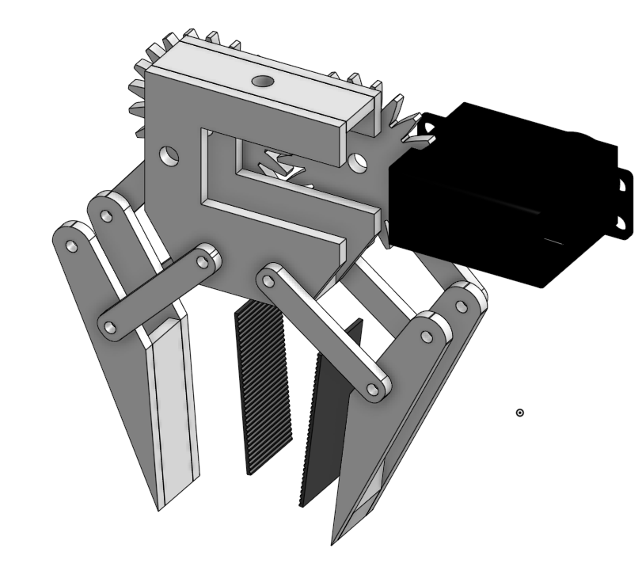

**Total logged hours: 60+ (design, code, training, outreach, competitions)**  
- All mechanical CAD built in Onshape, full system modeled in Blender.  
- AI inference run on YOLOv8 + simulated beach environments  

---

# March 20th: The idea was born  
While talking with Captain Butch Arbin, a veteran lifeguard in Ocean City, Maryland, we learned just how common—and deadly—rip currents are.

We then thought of a concept that could:
- Use computer vision to detect rip currents  
- Alert lifeguards via a live interface  
- Drop a flotation ring automatically  

We named the system: **Rescue Reach**.

**Total time spent: 3h**

---

# March 28th: CAD begins in Onshape  
Started modeling the payload drop system in Onshape. Specs were designed around the DJI Mini.

 

**Total time spent: 4h**

---

# April 4th: AI model
Found image classification model on RoboFlow that detects rip-currents and works pretty fast.
Tested it to see if it works. https://universe.roboflow.com/hrw/rip-rm14s

**Total time spent: 6h**

---

# April 12th: Beta web UI + model test  
Designed a simulated interface for lifeguards using HTML. When a “rip current” is detected, the interface displays:
- Drone GPS  
- Rip zone bounding box  
- Action buttons: Satellite Mode, Drone View, Verification, Broadcast Instructions, Life Preserver Drop, True Rip Current, False Alarm, Download/Send Images  

**Demo link:**  
🔗 [https://rustybubble.github.io/Rescue-Reach/satellite.html](https://rustybubble.github.io/Rescue-Reach/satellite.html)

**Total time spent: 5h**

---

# April 20th: Follow-up with Captain Butch  
Reconnected with Captain Butch Arbin to show our progress. He liked the concept and encouraged testing at rip-current-prone beaches like Playa Zipolite and Panama City Beach.

Feedback from a Delaware lifeguard:
- Interface must be easy to learn  
- Lifeguards shouldn’t need drone training  
- Alerts should be loud and visual  

That feedback shaped our lifeguard dashboard design.

**Total time spent: 3h**

---

# May 14th: Product Page  
Created a website for investors/competition judges to view our project.

https://josephkmathew.wixsite.com/rescuereach

**Total time spent: 20h**

---

# May 23rd: Pitch video production for competitions
Made a 5 minute pitch video with:
- Narration  
- Surf visuals  
- Overlay UI elements  

**Video link:**  
📹 [https://youtu.be/T3lOsVPMKPw](https://youtu.be/T3lOsVPMKPw)

**Total time spent: 4h**

---

# May 29th: Competitions + awards  
- **2025 Paradigm Challenge Finalist**  
- **Top 10 at University of the District of Columbia Capital Cup**

**Total time spent: 4h**

---

# July 5th: Outreach + funding search  
Contacted several organizations:
- NOAA Wakefield  
- Assateague State Park  
- WebCOOS  

Mr. Scott Schumann responded positively and offered to connect us with surf zone forecasters and lifeguards.

Began researching:
- NOAA SBIR  
- NSF I-Corps Microgrant  
- BOEM Environmental R&D Fund

**Total time spent: 5h**

---

| Quantity | Component                            | Cost (USD) | Link |
|----------|--------------------------------------|------------|------|
| 1        | DJI Mini 4K Drone (Refurbished)       | 239        | [Link](https://store.dji.com/product/dji-mini-4k-refurbished-unit?vid=177771) |
| 1        | Raspberry Pi 4 Model B (2 GB)         | 45         | [Link](https://www.pishop.us/product/raspberry-pi-4-model-b-2gb/) |
| 1        | Official Raspberry Pi 4 Power Supply (USB‑C) | 8.74    | [Link](https://www.adafruit.com/product/4298) |
| 1        | Raspberry Pi Camera Module V2 (8 MP)  | 25         | [Link](https://www.canakit.com/raspberry-pi-camera-v2-8mp.html?cid=usd&src=raspberrypi) |
| 1        | TowerPro MG996R Servo Motor           | 18         | [Link](https://www.amazon.com/4-Pack-MG996R-Torque-Digital-Helicopter/dp/B07MFK266B?th=1) |
| 1        | ESP32 Dev Board                       | 10         | [Link](https://www.amazon.com/HiLetgo-ESP-WROOM-32-Development-Microcontroller-Integrated/dp/B0718T232Z?dib=eyJ2IjoiMSJ9.XBINg-sjhfF_gUtnMiKGjjEQQzaaOnS0BOX5B4WtqfJASnDYgwFaaCAwKco5zmOHUdmnVz4FAfU1DgMWs40g63T788ZanWb4cPn4yujjBKUU0eJKyCu1NXim9cBoWChqDwEid3tgVJCXqLxZK103j-KUt6orIUgpFHuK9gWHl6HPBPs7eCMKmoOUn3MrzXgmauOI80VCKMGQorcYSD5tWPHiFRfFYg-4FS3cOx7o1aE.-jo-JVtHilthw9gEZHmVqCwWVD0wq6S5SkVMn2lI1IQ&dib_tag=se&keywords=ESP32+Dev+Board&qid=1753043643&sr=8-5) |
| 1        | Foam Flotation Ring (~14 cm)          | 11         | [Link](https://www.amazon.com/13-7-Inch-Safety-Preserver-Swimming/dp/B0F8HXP1W2?crid=14VXZTMLCPORJ&dib=eyJ2IjoiMSJ9.syQGI2MQARfpJEetLBsOotj33DeOIIUwSLb_EKh9DYhh089mnAAt7nmYtB6ehs1n7Ni8uK6fxoSAhRn0sS4rZjt6zLSs0-8SXJ-L1l6o2WNNmNygz9aXO9j2ggxxZzHv3eAz9LkgvOL8coeMQBk-b213yYWE_95gDISmk7Bd7mawjmQWmnvHIaPsPHectt5lqqGj8A2ANfRjh0la8LJdOGvBQ_u2H47ab_12zl67tnJpALDkg6G3tJvMP230UUz8NpcZCwr4WMqssM03DNO-tFUReRO1_BmRx7w3oaPNts0.WkYw7knLWJiMhl7Xplbyx5iIcpi0ffEVGbGIKdmvCLg&dib_tag=se&keywords=Foam+Flotation+Ring+%28%7E14%E2%80%AFcm%29&qid=1753043669&sprefix=foam+flotation+ring+14+cm+%2Caps%2C71&sr=8-13) |
| 1        | 3D‑printed Payload Pod (ABS/PLA)      | FREE       | 3D printer @ home |
